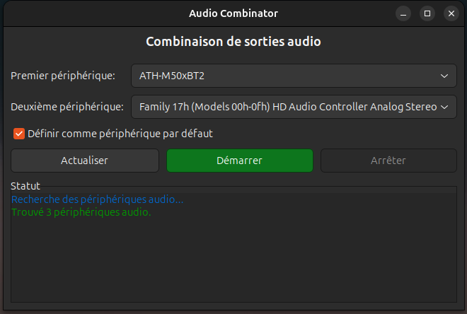

# Audio Combinator

[](https://opensource.org/licenses/MIT)


Une application graphique avancée permettant de combiner plusieurs sorties audio sous Linux avec contrôle de volume individuel. Idéale pour diffuser le son simultanément sur plusieurs périphériques audio avec un contrôle précis de chaque sortie.



## Fonctionnalités

- Interface graphique intuitive en GTK
- Détection automatique des périphériques audio
- **🎚️ Combine 2 à 8 périphériques de sortie simultanément**
- **🔧 Interface dynamique pour ajouter/retirer des périphériques**
- **🎛️ Contrôle de volume individuel pour chaque périphérique**
- **🔇 Boutons de sourdine individuels et général**
- **⚙️ Pré-configuration des volumes avant démarrage**
- **🎵 Contrôle de volume principal pour la sortie combinée**
- Compatible avec PulseAudio et PipeWire
- Option pour définir la sortie combinée comme périphérique par défaut
- Surveillance en temps réel de l'état de la sortie combinée
- Évite automatiquement les doublons de périphériques
- Volume par défaut sécurisé à 50%

## Cas d'utilisation

- **Gaming avancé** : Casque principal + haut-parleurs + casque streaming avec volumes ajustables
- **Bureau partagé** : Plusieurs casques avec contrôle de volume individuel pour chaque utilisateur
- **Studio amateur/semi-pro** : Monitors + casque de contrôle + sortie enregistrement
- **Systèmes multi-zones** : Audio dans différentes pièces avec contrôle de volume par zone
- **Streaming professionnel** : Sortie vers plusieurs destinations avec balance audio
- **Présentations** : Haut-parleurs locaux + sortie HDMI + casque de contrôle
- **Mixage audio en temps réel** : Balance et contrôle précis entre périphériques

## Prérequis

- Python 3.6 ou supérieur
- PulseAudio ou PipeWire
- GTK 3.0
- Bibliothèques Python : PyGObject, GLib

## Installation

### Sur Ubuntu/Debian/Linux Mint
```bash
# Installer les dépendances
sudo apt install python3 python3-gi python3-gi-cairo gir1.2-gtk-3.0 pulseaudio

# Cloner le dépôt
git clone https://github.com/yourusername/audio-combinator.git
cd audio-combinator

# Rendre le script exécutable
chmod +x audio_combinator.py
```

### Sur Fedora
```bash
# Installer les dépendances
sudo dnf install python3 python3-gobject gtk3 pulseaudio

# Cloner le dépôt
git clone https://github.com/yourusername/audio-combinator.git
cd audio-combinator

# Rendre le script exécutable
chmod +x audio_combinator.py
```

### Sur Arch Linux
```bash
# Installer les dépendances
sudo pacman -S python python-gobject gtk3 pulseaudio

# Cloner le dépôt
git clone https://github.com/yourusername/audio-combinator.git
cd audio-combinator

# Rendre le script exécutable
chmod +x audio_combinator.py
```

## Utilisation

1. **Lancez l'application** :
   ```bash
   ./audio_combinator.py
   ```

2. **Gérez vos périphériques** :
   - Utilisez le bouton "**+ Ajouter un périphérique**" pour ajouter jusqu'à 8 périphériques
   - Utilisez le bouton "**- Retirer le dernier**" pour supprimer des périphériques (minimum 2)

3. **Sélectionnez les périphériques audio** que vous souhaitez combiner dans chaque liste déroulante

4. **🎚️ Pré-configurez les volumes** (AVANT le démarrage) :
   - **Volumes individuels** : Réglez chaque périphérique selon vos préférences (défaut: 50%)
   - **Sourdine sélective** : Utilisez 🔊/🔇 pour désactiver temporairement certains périphériques
   - **Configuration immédiate** : Les réglages s'appliquent directement aux périphériques

5. **Cochez l'option** "Définir comme périphérique par défaut" si souhaité

6. **▶️ Démarrez** la combinaison - vos réglages pré-configurés sont conservés !

7. **🎛️ Contrôlez en temps réel** pendant l'utilisation :
   - **Volume général** : Contrôle global de toute la sortie combinée
   - **Volumes individuels** : Ajustements fins de chaque périphérique
   - **Sourdine générale et individuelle** : Contrôle flexible de l'audio

8. **⏹️ Arrêtez** quand terminé - tous les volumes reviennent à 50%

### Contrôles de Volume

#### **Avant le démarrage :**
- ✅ **Volumes individuels** → Actifs (règlent directement chaque périphérique)
- ✅ **Sourdine individuelle** → Active (met en sourdine chaque périphérique)
- ❌ **Volume général** → Inactif (la sortie combinée n'existe pas encore)

#### **Pendant la combinaison :**
- ✅ **Volume général** → Contrôle global de tous les périphériques
- ✅ **Volumes individuels** → Balance fine entre périphériques
- ✅ **Sourdine générale** → Coupe/rétablit toute la sortie combinée
- ✅ **Sourdine individuelle** → Contrôle sélectif par périphérique

### Exemples de Configuration

#### **Setup Gaming Pro**
```
1. Casque principal    → 70% (communication)
2. Haut-parleurs      → 30% (ambiance)
3. Casque streaming   → 45% (monitoring)
```

#### **Bureau Collaboratif**
```
1. Casque utilisateur 1 → 60%
2. Casque utilisateur 2 → 55%
3. Haut-parleurs communs → 🔇 (en sourdine)
```

#### **Home Studio**
```
1. Monitors studio    → 65% (mix principal)
2. Casque contrôle   → 50% (vérification)
3. Sortie enregistrement → 80% (capture)
```

## Fonctionnement technique

L'application utilise le module PulseAudio `module-combine-sink` pour créer une sortie virtuelle qui redirige l'audio vers plusieurs périphériques physiques. Le contrôle de volume utilise les commandes natives `pactl` pour ajuster chaque périphérique individuellement. L'interface graphique est construite avec GTK via PyGObject.

## Création d'un lanceur d'application

Pour faciliter l'accès à l'application, vous pouvez créer un lanceur dans votre menu d'applications :

```bash
# Créer un fichier .desktop
cat > ~/.local/share/applications/audio-combinator.desktop << EOL
[Desktop Entry]
Type=Application
Name=Audio Combinator Pro
Comment=Combiner plusieurs sorties audio avec contrôle de volume
Exec=/chemin/complet/vers/audio_combinator.py
Terminal=false
Categories=AudioVideo;Audio;
Keywords=audio;sound;mixer;combine;volume;
Icon=audio-card
EOL
```

Remplacez `/chemin/complet/vers/audio_combinator.py` par le chemin réel vers le script.

## Dépannage

### Aucun périphérique n'est détecté
- Vérifiez que PulseAudio est en cours d'exécution : `pulseaudio --check`
- Redémarrez PulseAudio : `pulseaudio -k && pulseaudio --start`
- Cliquez sur "Actualiser" dans l'application

### Le son ne fonctionne pas sur certains périphériques
- Vérifiez que tous les périphériques sont bien connectés et non mis en sourdine
- Vérifiez les volumes individuels (ils peuvent être à 0% ou en sourdine 🔇)
- Consultez les messages dans la zone de statut pour plus d'informations

### Les volumes ne s'appliquent pas
- Assurez-vous d'avoir sélectionné des périphériques différents dans chaque liste
- Vérifiez que PulseAudio répond aux commandes : `pactl list short sinks`
- Redémarrez l'application si nécessaire

### Erreur de création de sortie combinée
- Vérifiez que vous avez les permissions nécessaires pour utiliser PulseAudio
- Assurez-vous qu'aucune autre sortie combinée n'est déjà active
- Consultez les journaux système : `journalctl -xe | grep pulseaudio`

## Fonctionnalités avancées

### Pré-configuration intelligente
- Configurez vos volumes avant même de démarrer la combinaison
- Les réglages sont immédiatement appliqués aux périphériques individuels
- Démarrez avec votre configuration audio idéale déjà en place

### Contrôle en temps réel
- Ajustez tous les volumes pendant la lecture audio
- Aucune interruption de son lors des ajustements
- Feedback visuel instantané des modifications

### Interface adaptive
- L'interface s'adapte au nombre de périphériques choisis
- Gestion automatique des conflits de périphériques
- Interface professionnelle avec contrôles intuitifs

## Perspectives d'évolution

- ✅ **Prise en charge multi-périphériques** (2-8 périphériques)
- ✅ **Contrôle de volume individuel pour chaque périphérique**  
- ✅ **Pré-configuration des volumes avant démarrage**
- 🔄 Préréglages sauvegardables (profils audio)
- 🔄 Mode serveur pour une utilisation à distance
- 🔄 Interface améliorée avec visualisation audio en temps réel
- 🔄 Support pour les groupes de périphériques prédéfinis
- 🔄 Égaliseur par périphérique
- 🔄 Contrôle de la latence et synchronisation
- 🔄 Export/import de configurations
- 🔄 Interface web pour contrôle à distance

## Contribuer

Les contributions sont les bienvenues ! N'hésitez pas à :
- 🐛 Signaler des bugs
- 💡 Proposer des fonctionnalités  
- 🔧 Soumettre des pull requests
- 📝 Améliorer la documentation
- 🌍 Aider à la traduction

### Comment contribuer
1. Forkez le projet
2. Créez une branche pour votre fonctionnalité (`git checkout -b feature/AmazingFeature`)
3. Committez vos changements (`git commit -m 'Add AmazingFeature'`)
4. Poussez vers la branche (`git push origin feature/AmazingFeature`)
5. Ouvrez une Pull Request

## Licence

Ce projet est sous licence MIT. Voir le fichier [LICENSE](LICENSE) pour plus de détails.

## Crédits

Développé avec ❤️ pour la communauté audio Linux.

Merci à tous les contributeurs et à la communauté PulseAudio pour leur excellent travail.

---

**Audio Combinator** - Parce que votre audio mérite un contrôle professionnel ! 🎵